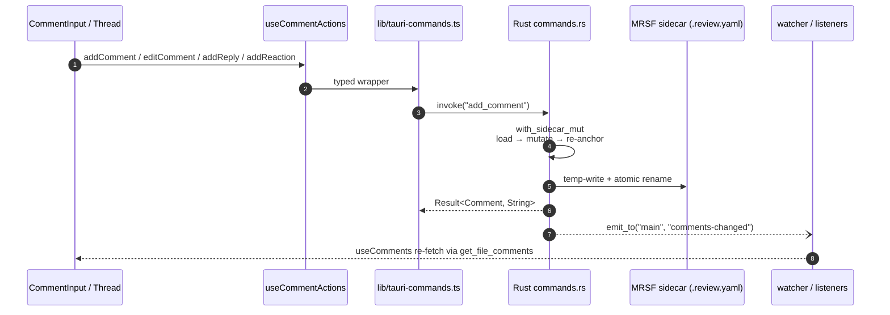

# Review Comments

## What it is

The core workflow of the app: a user reviewing AI-generated files selects a span of text, leaves an inline comment, replies, resolves, and moves on. Comments are threaded, line-anchored, indestructible across refactors, and persisted to disk next to the reviewed file — never to a database or a cloud service.

## How it works

Persistence lives in per-file MRSF sidecars (`foo.md` → `foo.md.review.yaml`). The MRSF v1.0 spec is kept as a [local reference](../specs/MRSF-v1.0.md) ([upstream](https://github.com/wictorwilen/MRSF/blob/main/MRSF-v1.0.md)); schema usage, atomic write protocol, and sidecar lifecycle are defined in [`docs/architecture.md`](../architecture.md) and [`docs/security.md`](../security.md). Rust is the source of truth: React asks for comments via a typed command, renders them, and sends mutations back — the frontend never writes YAML.

When a workspace root contains a `.mrsf.yaml` with a `sidecar_root:` entry, sidecars are written under that subdirectory instead of co-located. External edits to `.mrsf.yaml` are detected by the Rust watcher and announced to the renderer via the window-scoped `sidecar-config-changed` event so per-document sidecar paths re-resolve without an app restart — see [Watcher](watcher.md).

Anchoring survives file edits through a 4-step algorithm — exact match at original line, full-document exact search, line fallback, fuzzy Levenshtein, then orphan. The algorithm is implemented in Rust core and specified in [`docs/architecture.md`](../architecture.md) §4-step re-anchoring. Orphaned comments never disappear silently — they surface in the `DeletedFileViewer` when their file is removed, and in an orphan banner when their anchor text no longer matches.

### Anchor variants (v1.1)

Beyond the v1.0 `Line` anchor, MRSF v1.1 adds six non-line variants: `Image_rect`, `Csv_cell`, `Json_path`, `Html_range`, `Html_element`, and `Word_range`. `Word_range` pins comments to a UAX#29-tokenized span (start..end word indices on the line) plus a normalized text snippet — see `core/word_tokens.rs` and `core/types/mod.rs::WordRangePayload`. A further variant, `File`, anchors a comment to the whole file. Each typed variant has a heuristic resolver in `src-tauri/src/core/anchors/<matcher>.rs` (`image_rect.rs`, `csv_cell.rs`, `json_path.rs`, `html.rs`, `word_range.rs`) dispatched through `resolve_anchor` in `core/anchors/mod.rs`. The wire layout is FLAT (`anchor_kind` discriminator + per-variant payload sibling) so the v1.0 round-trip stays byte-identical for pure line anchors; the in-memory canonical form is the tagged `Anchor` enum (`src/lib/anchor-derive.ts`, `src-tauri/src/core/types/mod.rs`).

The five typed structured anchors (`Image_rect`, `Csv_cell`, `Json_path`, `Html_range`, `Html_element`) are **wire-layer passthrough only** in the current build: they survive in existing sidecars (loaded, matched, exported) but no UI authors them. The renderer sees them as `{ kind: "unknown" }` (see `deriveAnchor` in `src/lib/anchor-derive.ts`) until a future build re-introduces typed authoring. `Line`, `File`, and `Word_range` remain authorable. When a file is refactored and a v1.1 anchor cannot resolve, the matcher falls back to `anchor_history` (FIFO cap of 3 prior positions); if every history entry also fails, the comment becomes orphaned (`is_orphaned: true`); orphan presentation is surfaced separately from the gutter — see [Rule 31 in docs/architecture.md](../architecture.md) for the producer-side contract. Anchor history is maintained automatically by the matcher — there is no manual re-anchor IPC.

### Re-anchor visibility in the panel

When the matcher relocates a comment (i.e. `MatchedComment.original_line !== matched_line_number` or any `anchor_history` entry was consumed), `CommentThread` renders a non-interactive metadata row reading `originally line {original_line} → re-anchored to {matched_line_number}` above the comment body. The row is purely informational (no action), uses muted styling, and is suppressed for first-resolution exact matches AND for fully orphaned comments (the orphan banner takes precedence). This satisfies AC5 of #280 and surfaces what `core/matching.rs` did silently in prior iterations. Source of truth for the field: rule 31 in [`docs/architecture.md`](../architecture.md).

### File-level comments (`anchor_kind: "file"`)

File-level comments are first-class and **explicit**: the wire shape is `anchor_kind: "file"` with **zero** flat targeting fields (no `line`, `end_line`, `start_column`, `end_column`, `selected_text`, or `selected_text_hash`). `src-tauri/src/core/types/wire.rs` rejects sidecars where `anchor_kind: "file"` carries any of those fields with an `anchor_kind/payload mismatch` error — this guarantees the canonical `Anchor::File` variant is internally consistent and the matcher / UI / CLI all agree on intent.

Two practical consequences:

- **Binary-source safety**: `get_file_comments` and `get_file_badges` (the badge aggregator behind `useFileBadges`) skip `std::fs::File::open` entirely when every comment is `File`-anchored (or typed). The CLI binary (`mdownreview-cli read`) only reads the `.review.yaml` sidecar — never the source file — so file-level comments on `.png`, `.mp3`, deleted files, or arbitrary-byte sources work without UTF-8-decoding the source.
- **Surface labels**: `CommentsPanel` renders a `📄 File` pill in place of `Line N` for file-anchored threads. `ViewerToolbar` renders a discriminated **file/orphan pill** in its `centerSlot` showing the file-anchored unresolved count and the orphan count side-by-side; users see both numbers without opening the panel. Rendered output is exactly `"{N} file {M} orphan"` with zero-segment omission (e.g. `"1 file"` alone, `"2 orphan"` alone, `"1 file 1 orphan"` when both are non-zero, or hidden when both counts are 0). The pill subscribes via `useComments(filePath)` and derives counts from `MatchedRoot.anchor_kind === 'file'` (file count) and `MatchedRoot.isOrphaned` (orphan count) — never raw `anchor_kind` string equality elsewhere (rule 31 in [`docs/architecture.md`](../architecture.md)). The CLI prints `[<id>] file-level …` instead of `[<id>] line ?`.

### Authoring is panel-only

Every authoring entry point seeds a composer in the right-side `CommentsPanel`. The viewer body never mounts an inline composer or thread — comment text and the Save / Reply / Resolve / Delete affordances live exclusively in the panel.

Five entry points feed `requestLineCompose(filePath, anchor)` (Line) or `requestFileLevelInput(filePath)` (File), both of which auto-open the panel via `commentsPaneVisible: true`:

1. **Selection toolbar.** On `mouseup` over a non-collapsed text selection, a floating "Comment" chip appears above the selection (`SelectionToolbar.tsx`). Clicking it computes a Line anchor (`line`, `end_line`, `start_column`, `end_column`, `selected_text`, `selected_text_hash`) via `useSelectionToolbar.handleAddSelectionComment` and seeds a panel composer pre-filled with that anchor.
2. **`Ctrl/Cmd+Shift+M`.** `useGlobalShortcuts` calls `App.tsx::startCommentOnSelection`, which dispatches a synthetic `mouseup` from the selection's end and auto-clicks the toolbar's Comment button — same code path as a real mouse interaction.
3. **Source-view gutter `+` button.** Hover-revealed on every commentable line that has no comments yet. Click → `requestLineCompose` with `{ line, selected_text: <full line text> }`.
4. **Markdown gutter click.** A click in the left ~28 px of any commentable block (paragraph, heading, list-item, table cell, …) without comments triggers the same Line composer seed; on a block that already has comments, the click fires the cross-surface flash (see below).
5. **`Comment on file` button in `ViewerToolbar`.** Universally surfaced — including for binary / image / audio / "too-large" / deleted-file viewers. Sets `requestFileLevelInput(filePath)` so the panel auto-opens a file-level composer.

The selection toolbar and gutter affordances are **discovery + entry points**; the textarea and Save button always render in the panel. This keeps the viewer body free of UI chrome, makes the panel the single point of truth for comment authoring, and means file-level + line-level + selection composers all share one save path (`addComment` via `useCommentActions`).

Legacy v1.0 sidecars that omit *all* targeting fields (no `line`, no `anchor_kind`) keep their existing behavior — they deserialize as `Anchor::Line { line: 0 }` and the matcher's #131 fallback anchors them at line 1. They are NOT silently relabelled as file-level; if you want file-level semantics, add `anchor_kind: "file"`.

### Comment markers + cross-surface flash

Lines and blocks with unresolved comments are marked by a **bare blue Word-style speech-bubble glyph** in the gutter:

- **One bubble** for `count === 1`.
- **Two stacked bubbles** for `count >= 2` (rendered with the back bubble at 55 % opacity offset down-and-right behind the front).

In source view the marker is a real `<button>` rendered by `CommentMarker.tsx`. In markdown view it's a CSS `::before` pseudo-element on `.md-commentable-block.has-comments` (with the stacked variant in `::after`); clicks land on the gutter and route through `MarkdownViewer.handleGutterClick`. Both surfaces emit the same flash event when the marker is clicked.

**Highlight + flash effect.** Clicking a marker in either viewer **or** clicking a comment row in the panel triggers a 1 s yellow→transparent fade on every matching surface: the line(s) in the viewer flash via `flashElement` on `[data-source-line="N"]` / `[data-line-idx="N-1"]`, and every panel row keyed to the same `(filePath, line)` flashes via `[data-comment-line]`. The class is removed-and-readded with a layout-flushing `void el.offsetWidth` so re-clicking re-fires the animation every time. After the fade, no trace remains. The cross-surface event helper lives in `src/lib/comment-flash.ts`. The flash payload is a discriminated union (`{ kind: 'file' | 'line' | 'range' | 'unmatched', … }` in `src/lib/comment-flash.ts`) so the listener routes by anchor kind without re-deriving from numeric sentinels — the consumer-side counterpart to rule 31 in [`docs/architecture.md`](../architecture.md). For `kind === 'range'` with `endLine < line` (a defensive guard against bad call sites), the producer downgrades to `kind: 'line'` and emits `[web] flash kind=range with end_line<line, file=…, comment_id=…` via the unified logger.

### Author identity

New comments are stamped with a display name configured in the **Settings** dialog (gear button in the top toolbar). The value is persisted to `OnboardingState.author` in the app config directory via the `set_author` Tauri command, with strict validation (≤128 bytes, no control characters, no newlines) returning a typed `ConfigError` discriminator on rejection.

On every launch the renderer hydrates the cached display name via `get_author`, which falls back to the OS user — `USERNAME` (Windows) or `USER` (macOS / Linux), and finally `"anonymous"` — when nothing has been saved. This is read synchronously from the Zustand `authorName` cache by every `add_comment` call site (`useCommentActions`), so creating a comment never blocks on an IPC round-trip.

There is no authentication and no cloud component: the display name is purely a local label written into the MRSF sidecar alongside each comment. To use the env-var path, no extra crate is pulled in (Lean pillar — see [`docs/principles.md`](../principles.md)).

## Key source

- **UI components:** `src/components/comments/{CommentInput,CommentThread,CommentsPanel,CommentBadge,CommentMarker,SelectionToolbar}.tsx`; `src/components/SettingsDialog.tsx` (display-name field). `CommentsPanel` carries both the file-level `+` button (top-right of the header) and the line-anchored composer seeded by `pendingLineCompose`; the focused row (DOM focus from J/K and click) gets a `:focus-within` halo via CSS + `aria-current="true"` so the user can see which thread R will resolve. It also hosts the iter-9 filter row (search input + severity chips + workspace-wide toggle) whose state drives `useFilteredComments`; when "workspace-wide" is on, the list flattens threads from every file with sidecars via `useWorkspaceComments`. `ReactionRow` (in `CommentThread.tsx`) renders the `👍/✓/✗` glyphs that dispatch `update_comment` with an `add_reaction` patch via the VM `addReaction` action — see [`docs/architecture.md`](../architecture.md) §v1.1 reactions schema. `CommentMarker.tsx` owns the speech-bubble glyph rendered in the source-view gutter; the markdown side uses a CSS-only `::before` variant on `.md-commentable-block.has-comments`.
- **Markdown wiring:** comments inside `.md` documents are rendered through the Markdown viewer split (`MarkdownViewer.tsx` shell + `MarkdownComponentsMap.tsx` rehype/remark wiring + `CommentableBlocks.tsx` per-block data-attribute factories) — see [`docs/features/viewer.md`](./viewer.md). Each commentable block (paragraph, heading, list item, table cell) carries `data-source-line` and `data-comment-count`; the gutter-click handler in `MarkdownViewer` reads those attributes to route clicks to either a line composer (empty block) or a flash event (block with comments). Cells additionally carry `data-source-cell-line=N` so future per-cell affordances can target the deeper element when nested with an outer block on the same line.
- **TypeScript types:** `src/lib/anchor-derive.ts` — in-memory tagged `Anchor` discriminated union, `MrsfComment`, `MrsfSidecar`, `deriveAnchor`/`assertNeverAnchorKind` adapters that bridge the wire shape to the renderer's tagged form (mirrors Rust `core/types/wire.rs`). The auto-generated `src/lib/bindings.ts` (tauri-specta) is the source of truth for every wire-side type — `MatchedComment`, `CommentThread`, `CommentAnchor`, the per-variant payloads (`ImageRectAnchor`, `CsvCellAnchor`, `JsonPathAnchor`, `HtmlRangeAnchor`, `HtmlElementAnchor`, `WordRangePayload`), and the wire-shape `AnchorWire` envelope.
- **Structured viewers:** `src/components/viewers/{CsvTableView,JsonTreeView,MermaidView,ImageViewer,HtmlPreviewView}.tsx`. Each surfaces a `Comment on file` entry point via `ViewerToolbar`; none authors a typed-anchor variant in the current build (the five typed variants are wire-passthrough only — see *Anchor variants* above).
- **Hooks:** `src/hooks/{useSelectionToolbar,useThreadsByLine,useFileBadges}.ts`; `src/lib/vm/{useAuthor,useFilteredComments,useWorkspaceComments}.ts` (`useFilteredComments` derives the panel's rendered thread list from the search/severity/showResolved/workspaceWide filter state; `useWorkspaceComments` fans out per-file `get_file_comments` IPC calls when the workspace-wide toggle is on, keyed by the union of open tabs and `ghostEntries`)
- **Cross-surface flash:** `src/lib/comment-flash.ts` — `emitCommentFlash` / `onCommentFlash` / `flashElement` helpers used by `MarkdownViewer`, `SourceView`, and `CommentsPanel` to highlight matching anchors in 1 s yellow→transparent on marker / panel-row click. Imperative class restart (remove + reflow + re-add) defeats the browser's "same animation already running" no-op so re-clicking re-fires.
- **Store slice:** `src/store/comments.ts` — `commentsSlice` (focus + navigation + the `pendingScrollTarget` field that queues a cross-file scroll target consumed atomically by the destination viewer's `useScrollToLine` via `consumePendingScrollTarget(filePath)`; the slice deliberately exposes only `focusedThreadId` — there is no global "open input" tracking, every composer self-closes on Escape).
- **Drafts:** `src/lib/comment-drafts.ts` (`readDraft`/`writeDraft`/`clearDraft`) — localStorage-backed per-anchor slot used by every composer (`CommentInput`, `CommentThread` reply box, `CommentsPanel` file-level `+`). Keys are derived from `${filePath}::reply::${commentId}` or `${filePath}::new::${fingerprintAnchor(anchor)}` so drafts never collide across anchors. The slot is hydrated on mount, persisted on every keystroke, and cleared **only after** the IPC `add_comment`/`add_reply` resolves successfully — a transient failure surfaces an inline `role="alert"` save-error banner inside the composer (the only user-visible IPC error feedback in the comments surface) AND leaves the user's text intact in both the textarea and localStorage so they can retry without retyping. The banner is the canonical "the IPC failed, here's why" feedback path for comment authoring; silent failure is a regression. The panel-level `comments-panel-error` banner is reserved for the typed `outside-workspace` self-heal (where the panel also marks the tab read-only). Cancel and the toolbar dismiss path also clear the slot. Backed by an in-memory map fallback for SSR / quota-exceeded / privacy-mode browsers.
- **Keyboard:** `src/hooks/useGlobalShortcuts.ts` owns the document-level chord set: `Ctrl+Shift+M` starts a comment on the current text selection, `J`/`K` move focus through unresolved threads in the active file, `N` jumps to the next unresolved thread across files (the same action is surfaced as the **Next-unresolved** button in `ViewerToolbar`; cross-file scroll-to-line is handed off through the `pendingScrollTarget` field on `commentsSlice` rather than a `setTimeout` race — the destination viewer's `useScrollToLine` consumes the queued target on mount via `consumePendingScrollTarget`), `R` resolves the focused thread, `Alt+Left`/`Alt+Right` navigate tab history. Escape is **not** wired globally — each composer's `<textarea>` handles its own Escape (closes the input + clears the draft slot) so editor-local cancellation never races a global handler. The skip-when-editable guard in the hook protects every other chord from firing while the user types in any input.
- **Rust core:** `src-tauri/src/core/{anchors,matching,sidecar/,types/,word_tokens,comments,threads,severity,export,mrsf_version}.rs`
- **Commands:** `src-tauri/src/commands/comments/{mod.rs,get.rs,badges.rs,export.rs,update.rs}` — `mod.rs` hosts the mutating commands (`add_comment`, `add_reply`, `edit_comment`, `delete_comment`, `compute_anchor_hash`) plus the `NewCommentAnchor` IPC discriminator (an untagged enum that accepts both the canonical `{ kind: "..." }` tagged shape and the legacy flat `{ line, ... }` payload, then maps to the canonical `Anchor` enum); `get.rs` hosts `get_file_comments` and the resolution perf-guard tests; `badges.rs`/`update.rs`/`export.rs` round out the read/update/export surface. `update.rs::CommentPatch` exposes only `AddReaction` and `SetResolved` — manual re-anchoring (the prior `MoveAnchor` patch) was removed alongside the inline-comment refactor; the 4-step matcher and `anchor_history` FIFO handle file refactors automatically. Also: `src-tauri/src/commands/config.rs` — `set_author`, `get_author`; `src-tauri/src/commands/launch.rs` — `scan_review_files`.
- **Anchor resolver:** `src-tauri/src/core/anchors/mod.rs` — `resolve_anchor(&Anchor, &LazyParsedDoc) -> MatchOutcome` is the per-typed-anchor dispatcher invoked by `get_file_comments`, with heuristic resolvers per matcher: `image_rect.rs` (no-op coordinate validation), `csv_cell.rs` (header + primary-key lookup), `json_path.rs` (JSONPath traversal with optional scalar check), `html.rs` (HtmlRange + HtmlElement selector match), `word_range.rs` (UAX#29 word-index span verification). `LazyParsedDoc` (`OnceCell`) caches one parse per file per call regardless of comment count. `FileBadge.orphan_count` is not yet populated by the badge path — current badges count typed anchors as `Exact`; lazy orphan classification in the badge path is deferred to a future iter.

## Related rules

- MRSF v1.0 + v1.1 schema + 4-step re-anchoring — [`docs/architecture.md`](../architecture.md).
- Atomic sidecar writes and save-loop prevention — [`docs/security.md`](../security.md) + [`docs/design-patterns.md`](../design-patterns.md).
- Anchor branches each need an integration test — rule 3 + rule 8 in [`docs/test-strategy.md`](../test-strategy.md).
- Comment-matching branch coverage — rule 3 in [`docs/test-strategy.md`](../test-strategy.md); round-trip MRSF test — rule 8.
- "Reliable" pillar (comments indestructible across refactors) and "Zero Bug Policy" — [`docs/principles.md`](../principles.md).
- Multi-window emit scoping for `comments-changed` (window-set delivery via `emit_filter`) — `multiwin-window-scoped-events` in [`docs/best-practices-common/tauri/v2-patterns.md`](../best-practices-common/tauri/v2-patterns.md).
