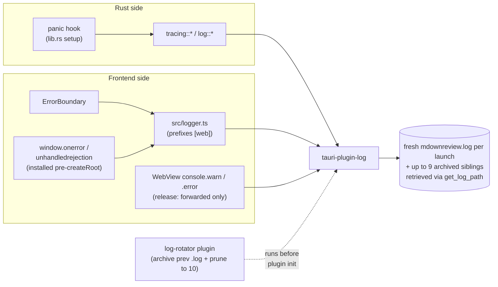

# Logging

## What it is

A single rotating log file captures output from both the Rust backend and the React frontend, with frontend messages tagged `[web]` and Rust messages flowing through `tracing`. Unhandled exceptions on either side are caught and routed into the same file — production users can attach one file when reporting issues. Each app launch starts with a fresh `mdownreview.log`; the previous session's file is archived to a UTC-timestamped sibling, and the log directory is pruned to a bounded number of files so disk usage stays predictable.

## How it works

Rust logging uses `tracing` + `tracing-subscriber` + `tauri-plugin-log` to route every `log::*` and `tracing::*` call to the rotating file. The same plugin exposes a frontend logger; `src/logger.ts` is the single frontend chokepoint (rule 2 in [`docs/architecture.md`](../architecture.md)) and prefixes every message with `[web]` before invoking the plugin.

Before `tauri-plugin-log` initializes, a tiny custom plugin (`log-rotator`, `src-tauri/src/log_rotation.rs`) registered first in the plugin chain performs two pre-init tasks:

1. **Per-launch archive.** If the previous session's `mdownreview.log` exists and is non-empty, it is renamed to `mdownreview.YYYY-MM-DDTHH-MM-SSZ.log` (UTC seconds, `:` replaced by `-` for cross-platform filename validity). On the rare collision (two launches within the same UTC second) a numeric suffix is appended (`.1`, `.2`, …). After the rename, the log plugin opens a fresh empty `mdownreview.log` for append.
2. **Bounded retention.** The log directory is pruned to at most **10** files matching `mdownreview*.log` (active + archives combined), oldest mtime first. The active file is never deleted, even if it has the oldest mtime. Unrelated files (`mdownreview-cli.log`, `notes.md`, `other.log`) are ignored.

Plugin registration order is a stable Tauri v2 contract — the same guarantee `tauri-plugin-single-instance` relies on. The `tauri-plugin-log` 5 MB intra-session size cap and `RotationStrategy::KeepAll` remain in place as a secondary safety net inside a single long-running session; the startup pass is what bounds disk usage across launches.

A panic hook installed in `lib.rs` converts Rust panics into logged error events before the process unwinds. On the React side, an `ErrorBoundary` component catches render-time errors and forwards them through `logger`; unhandled rejections on `window` are also captured. Tests install a `console.error` / `console.warn` spy at setup so a silent test failure that merely logs an error surfaces as a hard failure (principle 2 in [`docs/test-strategy.md`](../test-strategy.md)).

The log file lives in the OS-appropriate per-user location; users retrieve it via `get_log_path`. There is no in-app log viewer and no network log upload — both are Non-Goals in [`docs/principles.md`](../principles.md).

## Key source

- **Rust:** `src-tauri/src/lib.rs` (plugin registration, panic hook, rotation summary), any `tracing::*` calls throughout `src-tauri/src/`
- **Per-launch archive + retention:** `src-tauri/src/log_rotation.rs`
- **Frontend chokepoint:** `src/logger.ts`
- **Error capture:** `src/components/ErrorBoundary.tsx`
- **Command:** `src-tauri/src/commands/launch.rs` — `get_log_path`
- **Test contract:** `src/test-setup.ts` (console spy)

## Related rules

- Single logging chokepoint — rule 2 in [`docs/architecture.md`](../architecture.md). Tests MUST NOT import `@tauri-apps/plugin-log` directly — rule 23 in [`docs/test-strategy.md`](../test-strategy.md).
- `[web]` prefix on every frontend message — [`docs/design-patterns.md`](../design-patterns.md).
- Exception capture contract (Rust panic hook + React ErrorBoundary + `window.onerror` + `unhandledrejection`) — [`docs/security.md`](../security.md).
- Console silence as a first-class assertion — principle 2 in [`docs/test-strategy.md`](../test-strategy.md).
- No in-app log viewer; no log upload — [`docs/principles.md`](../principles.md) Non-Goals.

## Runtime tracing schemas

Two stable line schemas share this rotating file (issue #264 / PR3). The canonical home for the field reference, gating model, and the post-hoc `analyze-log` story is [`docs/observability.md`](../observability.md):

* **`[ipc] cmd=<name> duration_us=<u> payload_bytes=<n> ok=<bool>`** — emitted by every `#[mdr_command]`-wrapped Tauri command, target `"ipc"`. Errors land at `warn` level with `err=<sanitized>` and are **always-on**. Successful info-level lines are gated by the `--trace` launch flag (or `MDR_IPC_TRACE` env-var fallback) so the IPC hot path stays within the budget in [`docs/performance.md`](../performance.md).
* **`[startup] phase=<kebab-name> t_ms=<n>`** — emitted at most once per phase per process by `StartupRecorder`, target `"startup"`. Phases: `app-init`, `webview-ready`, `first-ipc`, `theme-applied`, `frontend-mounted`, `first-file-loaded`. Always-on regardless of `--trace`.
