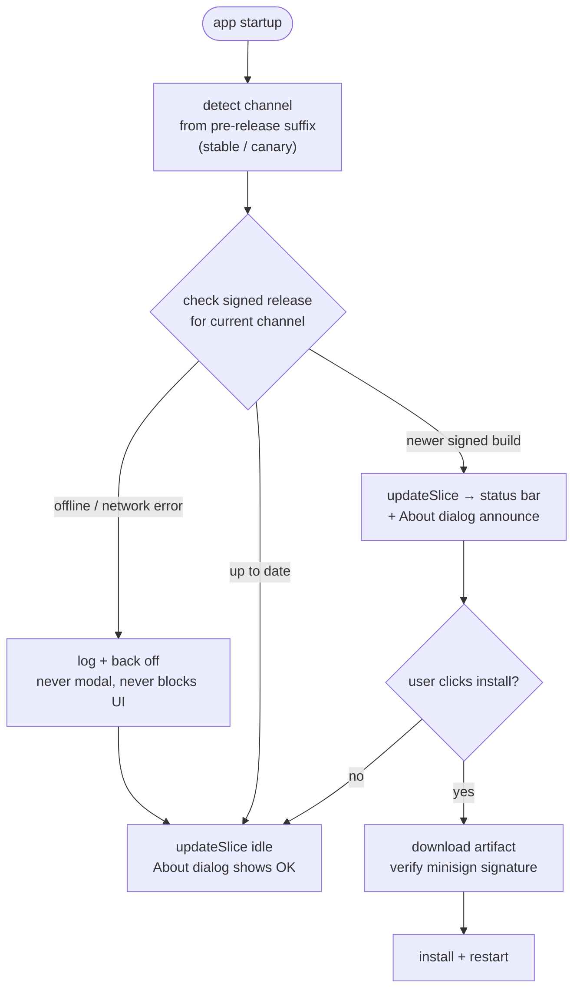

# Auto-Update

## What it is

mdownreview ships with two release channels: **stable** (default) and **canary** (pre-release opt-in). The updater checks for a new signed build on startup, announces updates in the UI, and installs them on user approval. Channel selection is a client-side toggle — the user can switch at any time without reinstalling.

## How it works

The update path uses the official Tauri updater plugin with signed-build verification. Channel detection is driven by the pre-release suffix of the current version (e.g., `-canary.3`) rather than a `-canary` substring — this keeps MSI packaging happy on Windows while still correctly identifying the channel.

Check logic is offline-tolerant: a failed check logs and backs off; it never blocks startup or pops a modal. The `updateSlice` carries update state into React; the About dialog and the status bar read from it. Downloads and installs are gated on explicit user action.

Release CI produces one installer per channel per platform; the GitHub release that matches the current channel is the update source.

## Channel hosting

| Channel | Endpoint | Hosting |
|---|---|---|
| stable | `https://github.com/dryotta/mdownreview/releases/latest/download/latest.json` | GitHub Releases — `latest.json` is attached as an asset of each `v*.*.*` release; GitHub's `releases/latest/` alias resolves to the most-recent non-prerelease. |
| canary | `https://dryotta.github.io/mdownreview/canary-latest.json` | GitHub Pages — `site/canary-latest.json` is tracked in the repo and deployed by `pages.yml`. |

The canary channel uses Pages (not a mutable release tag) because GitHub's **Release Immutability** feature permanently reserves the tag-name of any release it ever protects. A mutable `canary` release/tag would be locked the first time immutability is enabled and could not be recreated even after the setting is disabled. The Pages-tracked-file design is independent of the release subsystem and works regardless of repo-level immutability settings.

### Canary tag schema

Per-build canary releases use the schema `canary-{YYYYMMDDHHMMSS}-{run}-{shortsha}` (e.g. `canary-20260516181801-198-3be43cf`). Every tag is unique-per-build and never moved or recreated, so the immutability reservation problem cannot recur. The schema is lex-sortable, traceable to a commit, and human-readable at a glance.

### Recovery contract

If the Pages-hosted canary manifest is ever unreachable (Pages outage, hosting migration, etc.), canary users can recover by:

1. Open About dialog → switch **Update channel** from Canary to Stable
2. Check for Updates → install latest stable (which always has a working `CANARY_ENDPOINT` baked in)
3. Switch back to Canary → resume canary auto-updates

This is codified as the system's intentional recovery mechanism — no maintainer intervention required.

## Key source

- **Rust:** `src-tauri/src/update.rs`, `src-tauri/src/lib.rs` (plugin registration — both `tauri-plugin-updater` for download/install and `tauri-plugin-process` for the post-install `relaunch()` IPC)
- **Frontend:** `updateSlice` in `src/store/index.ts`
- **UI:** `src/components/AboutDialog.tsx`, `src/components/UpdateBanner.tsx`
- **CI:** release workflow files under `.github/workflows/` (triggered by the `/publish-release` skill)

## Restart fallback

The "Restart Now" button in `UpdateBanner` calls `restartApp()` →
`@tauri-apps/plugin-process` `relaunch()` → `plugin:process|restart`.
If that IPC rejects (plugin not registered, ACL denied, OS-level
relaunch failure) the banner switches to a **manual-relaunch**
message ("Update installed — quit and reopen mdownreview from your
installed location to apply.") instead of leaving the user staring
at a dead button. The new `.app` bundle has already been swapped
in by the updater plugin at this point — quitting and reopening
the app from its installed location (e.g. `/Applications` on
macOS) picks it up. A static parity test
(`src/__tests__/tauri-plugin-registration-parity.test.ts`) prevents
the underlying class of bug (JS plugin import without matching Rust
`init()` registration or ACL entry).

## Related rules

- Offline tolerance + no modal on failed check — [`docs/principles.md`](../principles.md) Reliable pillar.
- Signed-build verification is MANDATORY (never ship an unsigned updater path) — [`docs/security.md`](../security.md).
- Canary-channel detection rule (numeric-only pre-release suffix) — see commit history on `feat: canary release pipeline` + follow-up `fix: detect canary channel by pre-release suffix` for the concrete regression we avoid.
- Lean pillar: the updater is not a telemetry surface — no analytics, no health pings beyond the single version-check GET. [`docs/principles.md`](../principles.md) Non-Goals.
