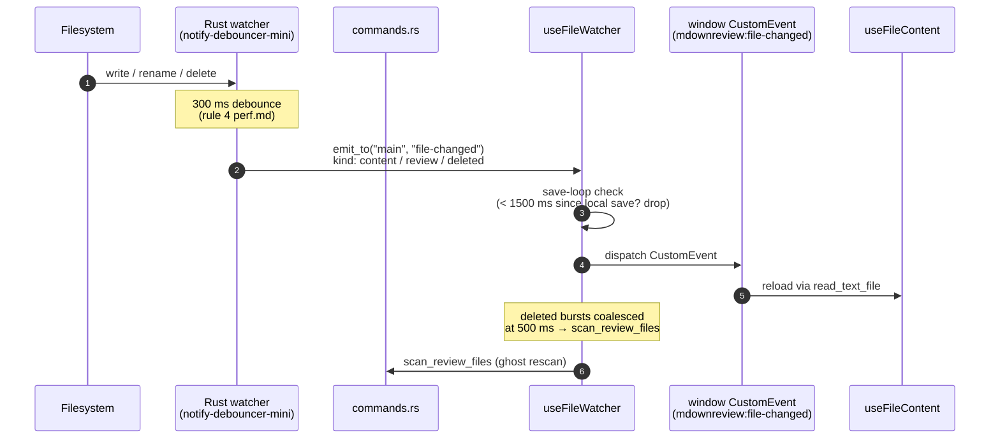

# File System Watcher

## What it is

While the user reviews files, mdownreview watches the workspace on disk. When a file the user is looking at changes — because the AI agent wrote a new version, or the user hit save in another editor — the tab refreshes. When a file is deleted, its tab flips to a "ghost" state that preserves any orphaned comments rather than silently discarding them.

## How it works

The Rust watcher (`notify-debouncer-mini`, canonical window defined in [`docs/performance.md`](../performance.md)) observes only the files and directories the UI has registered. There are two registration surfaces: `update_watched_files` for file-level watches that drive review-sidecar reloads, and `update_tree_watched_dirs(root, dirs)` for folder-level watches over the workspace root and currently-expanded folder-tree dirs (capped at `MAX_TREE_WATCHED_DIRS = 1024`). Events are debounced, deduplicated, then emitted as Tauri events addressed to specific windows (never broadcast — per rule 4 in [`docs/architecture.md`](../architecture.md)). Three distinct events are emitted: `file-changed` (kind `content | review | deleted`) for watched file paths, `folder-changed` (`{ path: string }` carrying the canonical directory) when a watched directory's listing changes, and `sidecar-config-changed` (`{ path: string }` carrying the canonical workspace root) when an external edit to that root's `.mrsf.yaml` is detected. Window-scoped fan-out for `sidecar-config-changed` uses the `mrsf_targets` helper (exact-match against the per-window `tree_watched_dirs` snapshot) and routes through the `WatcherEmitter` trait — the test seam exercised by `src-tauri/tests/watcher_emit_test.rs`.

On the React side, `useFileWatcher` installs one listener per visible tab and cleans it up on unmount. Rehydration uses the commands path (`read_text_file`, `check_path_exists`), not the event path, so bootstrap is deterministic even if events arrive before React's first `useEffect`.

Two debounce windows matter: the save-loop debounce (avoid re-triggering the watcher on our own sidecar writes) and the ghost-entry rescan (coalesce bursts of `deleted` events into one `scan_review_files`). Both windows are canonical in [`docs/performance.md`](../performance.md) and covered by isolation tests (rules 19 + 20 in [`docs/test-strategy.md`](../test-strategy.md)).

## Key source

- **Rust watcher:** `src-tauri/src/watcher.rs` — `update_watched_files`, `set_tree_watched_dirs`, `MAX_TREE_WATCHED_DIRS`, `classify_event`
- **Rust command:** `src-tauri/src/watcher.rs` — `update_watched_files`; `src-tauri/src/commands/fs/mod.rs` — `update_tree_watched_dirs`; `src-tauri/src/commands/launch.rs` — `scan_review_files`
- **Hook:** `src/hooks/useFileWatcher.ts`, `src/hooks/useTreeWatcher.ts`, `src/hooks/useFolderChildren.ts`
- **Store interactions:** `watcherSlice` in `src/store/index.ts`

## Related rules

- Debounce windows — rules 5 and 6 in [`docs/performance.md`](../performance.md).
- Commands mutate, events notify — rule 4 in [`docs/architecture.md`](../architecture.md).
- Listener cleanup on unmount (`unlisten` discipline) — [`docs/design-patterns.md`](../design-patterns.md).
- Debounce isolation tests — rules 19 + 20 in [`docs/test-strategy.md`](../test-strategy.md).
- Save-loop prevention — [`docs/security.md`](../security.md) §sidecar atomicity.
- Per-window watcher allowlist scope and `emit_to`/`emit_filter` event delivery — `multiwin-allowlist-scope` and `multiwin-window-scoped-events` in [`docs/best-practices-common/tauri/v2-patterns.md`](../best-practices-common/tauri/v2-patterns.md).
