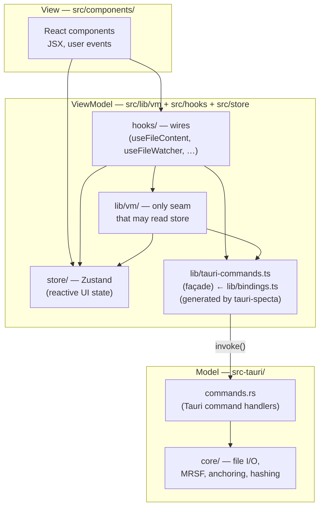

# Product Principles

Canonical charter for mdownreview. All other principles/rules docs derive from this one.

## One-sentence definition

mdownreview is a read-only, offline desktop reviewer that lets developers annotate AI-generated files in place — comments live beside the file, survive refactors, and never depend on a server.

## Five product pillars

Every feature, review decision, and engineering trade-off is judged against these five pillars.

### Professional
The app looks and feels like a tool a developer would pay for. Instant keyboard shortcuts, native menubar, polish details (ghost entries, comment badges, "Copy path" in About), no amateur rough edges. Shipping a feature that is visibly half-finished damages this pillar more than not shipping it at all.

### Reliable
Every byte the user has authored — comments, viewer-edited file content, sidecar state, settings — is durable across crashes, refactors, terminations, third-party-library version bumps, and power loss. Comments remain the foundational example: MRSF sidecars, the re-anchoring algorithm, ghost entries for deleted sources, atomic writes, save-loop prevention, and a watcher that survives editor rename patterns all exist to honor this pillar. A feature that risks losing a user comment does not ship. A feature that *writes user files* (the Excalidraw carve-out) inherits an editor-grade reliability obligation no weaker than the comments-pillar baseline — see the carve-out paragraph in [Non-Goals](#non-goals).

### Performant
Fast startup, fast file open, fast search, fast render — even on folders of thousands of files. Performance is measured, not intuited. Budgets are numeric and tracked.

### Lean
Minimal memory, minimal disk, minimal dependencies, minimal binary size. Every new dependency earns its place. The app is a viewer, not a platform.

### Architecturally Sound
Clean layer boundaries, narrow IPC surface, single chokepoints for IPC and logging, testable in isolation. A codebase that stays comprehensible at 10× its current size.

## Five engineering meta-principles

How we work. Non-negotiable.

### 1. Rust-First with MVVM

The app is built as a strict MVVM (Model–ViewModel–View) stack. The boundaries are not suggestions.

- **Model — Rust** (`src-tauri/src/core/`, `src-tauri/src/commands/`). Owns data and business logic: file I/O, path manipulation, MRSF parse/serialize, comment anchoring, hashing, scanning, threading, validation. Exposed only via typed Tauri commands. Never reimplemented in TypeScript.
- **ViewModel — `src/lib/vm/` + `src/hooks/` + `src/store/`.** Bridges the Model to the View. Cancellation, loading states, debounce, derived values live here. No DOM, no JSX, no raw `invoke()` (uses `src/lib/tauri-commands.ts`).
- **View — `src/components/`.** Renders ViewModel state and dispatches user actions. No IPC calls, no business rules, no file-path manipulation.

When adding a feature: *what does the Model own? what hook in the ViewModel exposes it? what component renders it?* A component that calls `invoke()` or holds business state is a layering violation and does not merge. A hook that serializes YAML or computes anchors is a Rust-First violation and does not merge.

### 2. Never Increase Engineering Debt

Every change leaves the codebase cleaner than it found it. Literally:

- **Hold debt flat or reduce it.** A change that adds a new pattern without consolidating the old one is net debt. The cleanup ships in the same PR.
- **Close Gaps actively.** Every deep-dive doc has a Gaps section. When you're in the area, pick one and close it.
- **Delete dead code in the same PR.** A refactor that leaves the replaced function, import, or pattern around is incomplete.
- **No TODOs, no workarounds, no "fix later".** Solve it properly or don't make the change.
- **Drift from canonical patterns is debt** — not just bad code. Any divergence from `docs/architecture.md` or `docs/design-patterns.md` counts.

The goal is not to hold debt constant. It is to actively shrink it every change.

### 3. Zero Bug Policy

Every confirmed bug gets fixed. "Fixed" has three requirements:

- **Clean architecture.** The fix uses the layer boundaries in `docs/architecture.md`. If the bug exists because logic leaked across layers, the fix moves it back — no workarounds that silence the symptom.
- **Clean design pattern.** The fix uses the idioms in `docs/design-patterns.md` (cancellation flags, `useShallow`, `emit_to("main", …)`, atomic sidecar writes). A patch that violates an established pattern is new debt, not a fix.
- **Regression test.** Every fix ships with a test that reproduces the original failure mode. A race-condition fix needs a test that reproduces the race. Without the test, the fix is not done.

### 4. Proper Fix Over Patch

Every change uses the platform's intended architecture. Never hack around a limitation with a targeted workaround that papers over a structural problem.

- **Fix the design, not the symptom.** When a bug reveals a structural mismatch — e.g. a global mechanism used where a per-instance one is needed — the fix replaces the mechanism, not adds a compensating shim. A focus-tracker bolted onto a global menu dispatcher is a patch; per-window menus with window-scoped handlers is a proper fix.
- **Use the platform's grain, not against it.** Tauri, React, and the OS each have intended patterns for common problems (per-window menus, `emit_to` for targeted events, `useShallow` for selective re-render). When the codebase uses a weaker alternative (global broadcast + frontend filtering, `is_focused()` polling), the fix migrates to the intended pattern — even if the weaker alternative "works most of the time."
- **Scope is not an excuse.** A proper fix may touch more files than a patch. That is expected. A three-file patch that leaves the wrong abstraction in place is more expensive long-term than a twenty-file refactor that installs the right one. When scoping a fix, optimize for the codebase after merge, not for the size of the diff.
- **If the platform can't do it, redesign the approach.** When the framework genuinely lacks a needed capability, adapt the design to work within the framework's model. Don't bolt on a workaround that fights the framework and breaks on the next update.

### 5. Docs Reflect Shipped Code

Feature documentation (`docs/features/`) describes what is implemented and shipped — not aspirational designs or planned work. Planned features belong in issue descriptions or design specs (`docs/superpowers/specs/`), never in the feature docs that agents and contributors read as ground truth.

- The PR that ships a feature updates the corresponding feature doc in the same commit.
- The PR that removes a feature updates the doc in the same commit.
- A feature doc that describes UI or behavior that does not exist in the code is a bug, not a roadmap.

## Deep-dive documents

The rules that operationalize the pillars and meta-principles live in domain docs. Every rule is numbered and citable as "violates rule N in `docs/X.md`".

| Document | Governs |
|---|---|
| [`docs/architecture.md`](architecture.md) | Layer separation, IPC contract, Zustand boundaries, file-size budgets, MRSF v1.0 ([spec](specs/MRSF-v1.0.md), [gap analysis](specs/MRSF-v1.0-gap-analysis.md)) + v1.1 schema |
| [`docs/performance.md`](performance.md) | Numeric budgets, debounce windows, scan caps, render rules |
| [`docs/security.md`](security.md) | IPC surface, path canonicalization, markdown XSS posture, CSP, sidecar atomicity |
| [`docs/design-patterns.md`](design-patterns.md) | React 19 + Tauri v2 idioms, hook composition, error capture |
| [`docs/test-strategy.md`](test-strategy.md) | Three-layer pyramid, coverage floors, IPC mock hygiene |

## Non-Goals

Explicitly out of scope. Each would damage one of the five pillars.

- Editing file content — *except* for files whose canonical authoring surface is part of the file format itself (currently the `.excalidraw` family: `.excalidraw`, `.excalidraw.png`, `.excalidraw.svg`). For these, "viewing" without round-tripping the embedded scene would mean shipping a degraded read-only fork of the upstream tool, breaking *Professional*. The carve-out is bounded by an extension allowlist enforced at a single Rust write chokepoint (rule 32 in [`docs/architecture.md`](architecture.md), rule 29 in [`docs/security.md`](security.md)) so the Non-Goal stays load-bearing for every other file type.

  **`.excalidrawlib` is view-only** (iter-22 redesign). Libraries are reusable shape collections — not documents the user authors line-by-line — so the Editor segmented-control button is hidden for `.excalidrawlib` paths and the canvas always renders with `viewModeEnabled=true`. The library sidebar stays open in Visual mode so the user can browse the curated shapes; Source mode shows the raw JSON.

  **Editor-grade reliability contract** (canonical `.excalidraw` + PNG/SVG variants only). Editor-mode edits autosave on a 2-second debounce (no explicit Save button). The carve-out is held to editor-grade reliability — every byte the user has authored is durable across crashes, refactors, terminations, third-party-library version bumps, and power loss. Concretely the autosave-only design ships:
  - A single combined first-Editor-entry disclosure banner (autosave + MRSF re-anchor warning) that cannot be reached without the user acknowledging both behaviours.
  - A persistent **save-state indicator** (`saved` / `unsaved` / `saving…` / `failed` / `paused`) at the canvas bottom-middle whenever Editor mode is active. Hidden until the user makes the first edit; auto-fades 2 s after entering the saved state. The user can answer "are my last 30 seconds on disk?" at any time without instrumenting the FS.
  - A **must-acknowledge** SaveErrorBanner: in the 3-strike failure-paused state the only exit is `Resume`; `Dismiss` is hidden so a user cannot silently dismiss a paused autosave loop.
  - A deterministic close-flush handshake that drains every pending save before window destroy on tab close, window close, app close, OR macOS Cmd+Q (`RunEvent::ExitRequested`). The handshake bypasses the failure-pause guard for a single user-final attempt — the pause backs off automatic retries, never the user-final save.
  - A per-file warning shown on every Editor entry whose MRSF sidecar holds line-anchored review comments — the once-per-profile FirstEntryBanner is not enough when months later a user reopens an old file with another reviewer's comments.

  The carve-out's continued existence is conditional on (a) the round-trip preservation tests for every shipped fixture in `samples/excalidraw/` (pinned by SHA in `samples/excalidraw/.fixtures.lock`, see `src/lib/excalidraw/__tests__/saveScene.roundtrip.test.ts`) being CI-green, and (b) zero open data-loss-class P0s in `docs/retrospectives/`. If either condition fails for two consecutive releases, the carve-out is reverted and Excalidraw becomes view-only across the family. See [`docs/features/excalidraw.md`](features/excalidraw.md) and the retrospective at [`docs/retrospectives/2026-05-03-352-data-loss-class.md`](retrospectives/2026-05-03-352-data-loss-class.md).
- Git integration, diff views, version history (competitor space; pressures *Lean* + the 10 MB viewer limit).
- Cloud sync or real-time collaboration (breaks *Lean* + *Reliable* by forcing auth/backend).
- Plugin/extension system (breaks *Architecturally Sound* via stable-API lock-in).
- Remote log shipping or telemetry (breaks the offline trust model).
- Log viewer UI inside the app (log file + "Copy path" is sufficient).
- Linux `.desktop` file association.
- File type associations other than `.md`/`.mdx`.
- Built-in AI chat / "ask the agent" (mdownreview is the *human* side of the loop).
- Comment notifications / realtime multi-reviewer presence (solved asynchronously via sidecars + git).

## How to use this charter

- **Adding a feature?** It must strengthen at least one pillar without damaging another. If you can't identify which pillar it serves, it's not worth adding.
- **Reviewing a PR?** Check the diff against the deep-dive docs. Cite "violates rule N in docs/X.md".
- **Filing an issue?** Identify which pillar is degraded and quote the rule that covers it.
- **Disagreeing with a rule?** Propose a change to the rule. Don't work around it silently.
