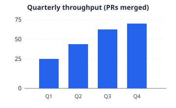

# 02 · Tables

Exercises GFM tables of various widths, alignments, and cell complexity.

## Simple 3×3

| Name | Type | Notes |
|---|---|---|
| `read_text_file` | IPC command | Returns `TextFileResult { content, size_bytes, line_count }` |
| `write_atomic` | core helper | Temp-file + rename |
| `convertFileSrc` | Tauri API | Wraps a path as `asset:` URL |

## Alignment row (left, center, right)

| Left-aligned | Centered | Right-aligned |
|:---|:---:|---:|
| short | short | short |
| a longer string here | mid | 12345 |
| 1 | 100 | 100000 |
| **bold** | _italic_ | `code` |

## Wide table — many columns

| Col 1 | Col 2 | Col 3 | Col 4 | Col 5 | Col 6 | Col 7 | Col 8 |
|---|---|---|---|---|---|---|---|
| a | b | c | d | e | f | g | h |
| 1 | 2 | 3 | 4 | 5 | 6 | 7 | 8 |
| α | β | γ | δ | ε | ζ | η | θ |

> The viewer should scroll the table horizontally if it overflows the reading column,
> or wrap cell content — depending on the active CSS strategy.

## Tall table — many rows

| Iteration | Outcome | Files | Tests | Notes |
|---|---|---|---|---|
| 1 | passed | 8 | 1 added | wave 1+2 + forward-fix |
| 2 | passed | 4 | 0 | docs touch-ups |
| 3 | degraded | 12 | 2 | flake on native E2E |
| 4 | passed | 5 | 1 | rebase clean |
| 5 | passed | 9 | 3 | new IPC surface |
| 6 | passed | 2 | 0 | typo fixes |
| 7 | passed | 6 | 1 | watcher tweak |
| 8 | passed | 3 | 0 | doc cross-refs |
| 9 | passed | 4 | 1 | new viewer module |
| 10 | passed | 7 | 2 | sidecar-shape regression |
| 11 | passed | 1 | 0 | trailing whitespace |
| 12 | passed | 5 | 1 | new IPC chokepoint |

## Cells with complex content

| Field | Spec | Example |
|---|---|---|
| `mrsf_version` | Always `"1.0"` or `"1.1"` | `mrsf_version: "1.1"` |
| `document` | Path of the reviewed file (relative) | `document: src/main.rs` |
| `comments[].anchor` | Tagged union: `Line` / `WordRange` / `JsonPath` / `CsvCell` / `HtmlRange` / `HtmlElement` / `ImageRect` / `File` / `Unknown` | `anchor:\n  kind: line\n  line: 42` (in YAML) |
| `comments[].text` | Markdown body of the comment | _supports_ **GFM** + `code` + [links](#) |
| `comments[].responses[].timestamp` | ISO-8601 UTC | `2026-04-30T13:26:00Z` |

## Empty cells, ` `, escapes

| A | B | C |
|---|---|---|
| | empty cell to the left | |
| line one line two | `pipe \| inside code spans is fine` | escape outside code: \\ |
| 1 | 2 | 3 |

## Keys row (links wrapping inline images)

| Channel | Logo | Link |
|---|---|---|
| GitHub |  | <https://github.com> |
| Repo  |  | <https://github.com/dryotta/mdownreview> |

## Trailing checklist

- [ ] Wide table either scrolls or wraps; doesn't overflow the viewer.
- [ ] Alignment row honors `:--`, `:-:`, `--:`.
- [ ] ` ` renders as a hard break inside the cell.
- [ ] Cells with images render the image and (when wrapped in a link) make the image clickable.
