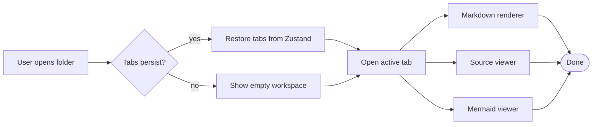
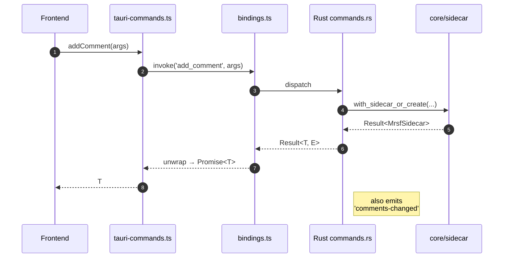
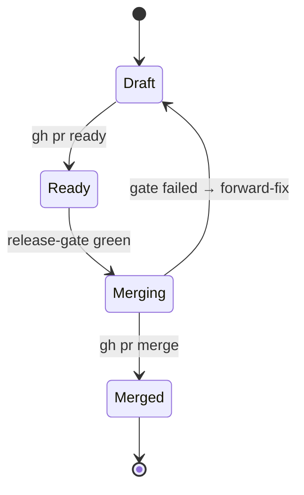
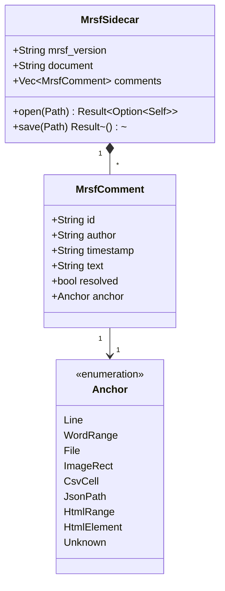
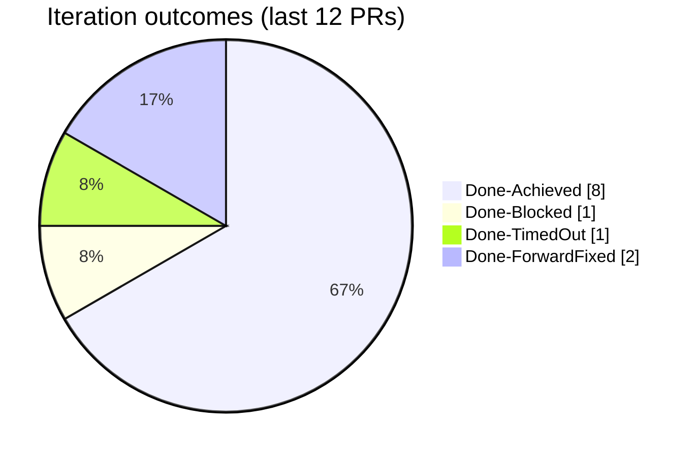
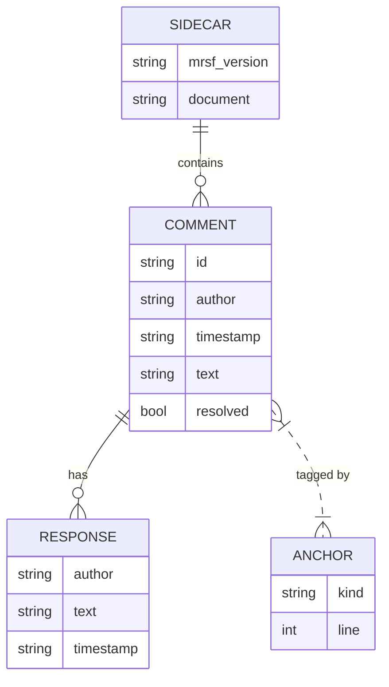

# 06 · Mermaid diagrams

Inline `` ```mermaid `` fences render via the same lazy `MermaidView`
chunk used by stand-alone `.mmd` files (see
`src/components/viewers/markdown/MarkdownComponentsMap.tsx::MermaidEmbed`).

> **Note:** Mermaid runs with `securityLevel: "strict"` (rule 15 in
> `docs/security.md`), so click-events / `onMermaidClick` callbacks are
> intentionally not wired.

## Flowchart



## Sequence



## State diagram



## Class diagram



## Pie chart



## Gantt

```mermaid
gantt
    title Iterate-loop run timeline
    dateFormat HH:mm
    axisFormat %H:%M
    section Setup
    Pre-flight + branch       :a1, 13:26, 1m
    Draft PR + state file     :a2, after a1, 1m
    section Iteration 1
    Step 1 rebase + sanity    :b1, after a2, 2m
    Step 2 assess             :b2, after b1, 1m
    Step 3 pre-consult        :b3, after b2, 2m
    Step 5 implement waves    :b4, after b3, 5m
    Step 6 validate + CI      :b5, after b4, 12m
    Step 6d forward-fix       :b6, after b5, 4m
    Re-validate + experts     :b7, after b6, 13m
    section Iteration 2
    Re-rebase + assess        :c1, after b7, 2m
    Done-Achieved + Phase 2   :c2, after c1, 2m
```



## ER diagram



## Trailing checklist

- [ ] Each diagram renders without an "Error rendering" message.
- [ ] Diagrams pick up the active light/dark theme palette (mermaid v10 default theme).
- [ ] No copy button on mermaid blocks (excluded by `MarkdownComponentsMap`).
- [ ] Resizing the window doesn't break the SVG layout.
