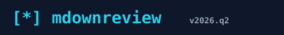
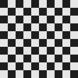

# 07 · Local Images (relative paths)

Tests the `convertFileSrc` chokepoint at
`src/components/viewers/MarkdownViewer.tsx:302-309` (rule 14 in
`docs/security.md`): every local `` is rewritten to
`asset:` (or the Windows `http://asset.localhost` form) so the WebView
loads via the asset protocol, never raw `file://`.

All images live in [`./images/`](./images/) — relative paths only.

## Format coverage

### SVG (text-based, scalable)

### PNG (raster, alpha)

### Tiny image (16×16)

## Aspect-ratio extremes

### Tall narrow strip (80×600) — should not stretch the viewer

### Wide short strip (600×80)

## Image as a link

> Click the image: per rule 13 in `docs/security.md`, `MarkdownViewer.tsx:146-148`
> only opens `http(s)` URLs. The asset is NOT a navigation target — only
> the wrapping `<a href>` is.

## Inline images in flowing text

This sentence has an inline image  right in
the middle of its text — the viewer should size it sensibly relative to
the text baseline (or wrap it as a block — both are acceptable).

A list with inline image bullets:

-  Repo logo
-  Banner
-  Quarterly chart

## A grid of thumbnails (via table)

| Logo | Chart | Banner |
|---|---|---|
|  |  |  |
|  |  |  |

## Trailing checklist

- [ ] Every image renders (no broken-image icon).
- [ ] DevTools Network tab shows requests via `asset:` (or `http://asset.localhost`), never `file://` (rule 17 in `docs/security.md`).
- [ ] Tall and wide aspect-ratio images stay inside the reading column without stretching.
- [ ] Click-through on the linked image opens the target (`gh.com`) via the system browser.
- [ ] DevTools console: zero errors / warnings.
