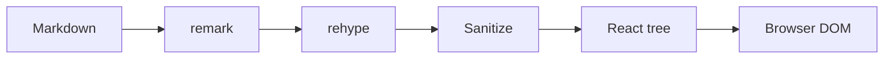

# 11 · Kitchen Sink

One page that uses **every** feature from files 01–10 — useful for
screenshots, regression scans, and a quick "does anything render
differently than I remember?" sanity check.

> [!TIP]
> If you found a regression on this page, narrow it down by opening
> the dedicated single-feature file (01–10) that covers the surface.

---

## Heading anchors

This document has six heading levels. Each gets an autolinked anchor.

# Level 1
## Level 2
### Level 3
#### Level 4
##### Level 5
###### Level 6

## Inline formatting in one paragraph

A paragraph with *italic*, **bold**, ***bold italic***, ~~strikethrough~~,
`inline code`, [an inline link](https://github.com),
<https://www.rust-lang.org> autolink, an inline image
, inline math $E = mc^2$, an
<abbr title="Inter-Process Communication">IPC</abbr> abbreviation, a
keyboard hint <kbd>Ctrl</kbd>+<kbd>K</kbd>, subscript H<sub>2</sub>O,
superscript x<sup>2</sup>, and a footnote reference[^kitchen].

[^kitchen]: A footnote that references back to its source. Multi-paragraph footnotes work too.

    A second paragraph in the same footnote.

## A list mixing every kind of inline content

- [x] Done — first task
- [ ] Pending — second task
- [ ] **Bold** task with `inline code` and a [link](#)
- [ ] Task with inline math: $\sigma = \sqrt{\frac{1}{n}\sum_{i=1}^{n} (x_i - \bar{x})^2}$
- [ ] Task with inline image: 
- [ ] Nested:
  - [x] Sub-task done
  - [ ] Sub-task pending

## A blockquote with everything inside

> A multi-line quote with **bold**, *italic*, `code`, a [link](#),
> , inline math $\pi \approx 3.14$,
> a <kbd>Tab</kbd> hint, and a footnote-style reference.
>
> > Nested blockquote inside the outer one.
> >
> > > Triple-nested.

## Table with every kind of cell content

| Field | Value | Inline content |
|:---|---:|:---:|
| Bold | 100 | **bold** |
| Italic | 200 | *italic* |
| Code | 300 | `let x = 1;` |
| Link | 400 | [GitHub](https://github.com) |
| Math | 500 | $a^2 + b^2$ |
| Image | 600 |  |
| Multi-line | 700 | line one<br>line two |

## Code block — Rust

```rust
fn main() {
    println!("kitchen sink");
}
```

## Display math

$$
\int_0^{\infty} e^{-x^2}\, dx = \frac{\sqrt{\pi}}{2}
$$

## Mermaid diagram



## Local image grid + remote image

| Local SVG | Local PNG | Remote |
|---|---|---|
|  |  |  |

## All five GitHub alert types in one page

> [!NOTE]
> A note.

> [!TIP]
> A tip.

> [!IMPORTANT]
> Important information.

> [!WARNING]
> A warning.

> [!CAUTION]
> A caution.

## Disclosure with code inside

<details>
<summary>How to launch the dev build</summary>

```bash
npm install
npm run tauri:dev
```

The dev build hot-reloads when files change.

</details>

## Horizontal rule

---

## Trailing inline-code spans for spacing

`one` `two` `three` `four` `five` `six` `seven` `eight` `nine` `ten`

## Trailing checklist (kitchen sink)

- [ ] No layout overflow.
- [ ] DevTools console: zero `console.error` / `console.warn`.
- [ ] All five GFM alerts visible.
- [ ] Mermaid diagram rendered (not stuck on "Loading…").
- [ ] KaTeX block + inline math both rendered.
- [ ] Local + remote images both rendered.
- [ ] Footnote `↩` back-link clicks scroll back to the reference.
- [ ] Adding a comment to any block / line / word range works.
